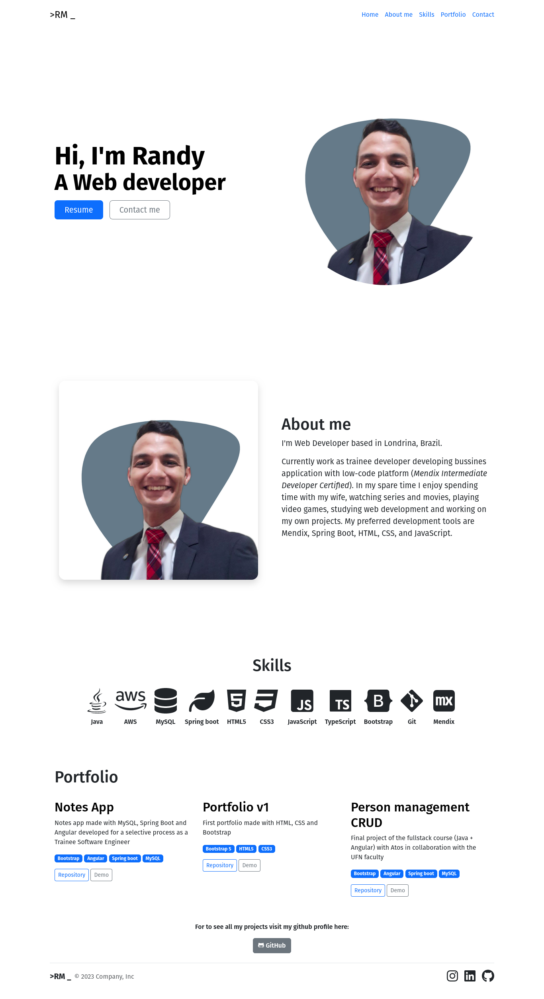

# Portfolio v2

Porfolio made with HTML, CSS and Bootstrap as capstone project of the course Web Development Bootcamp with Angela Yu in Udemy.

---

## Screenshot

---

## Build in

- HTML5
- Bootstrap 5
- CSS3

---

## Demo

[https://randymz10.github.io/portfoliov2/]

---

## Author

[@randymz10](https://github.com/randymz10)

[in/randymz10](https://linkedin.com/in/randymz10)
